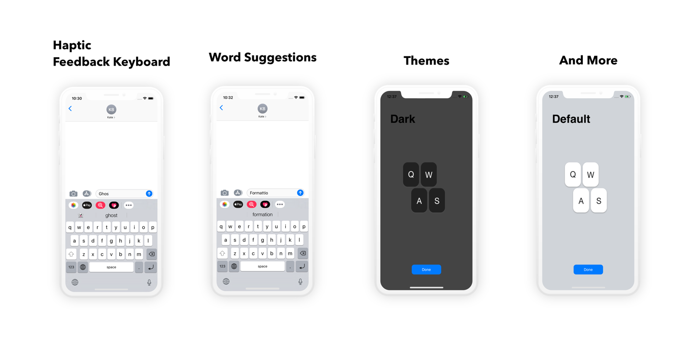
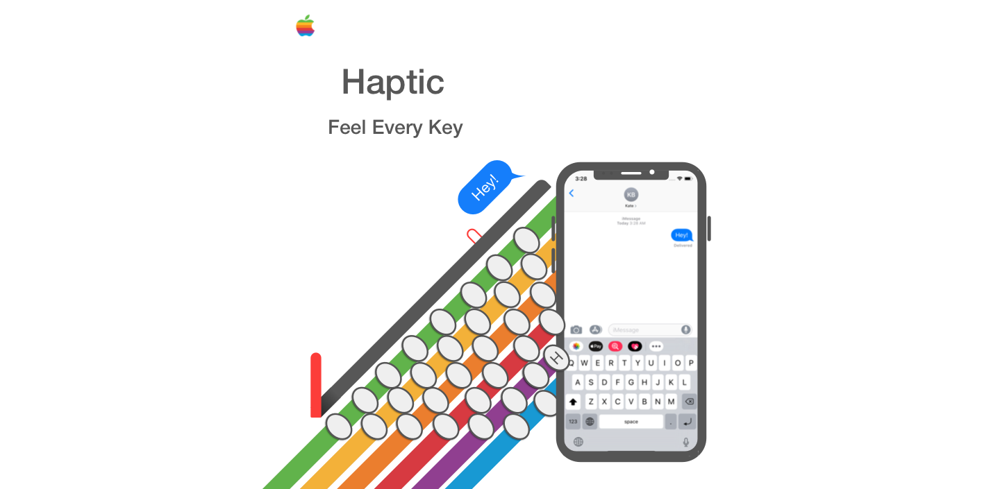

### Haptic Feedback Keyboard

A keyboard extension that provides the default keyboard experience while providing a small vibration for each key press.

Originally a closed source project, but now open source due to a limitation in the TapicEngine API that prevents the use of the Tapic Engine in extensions. **Works on iOS versions < 13**

